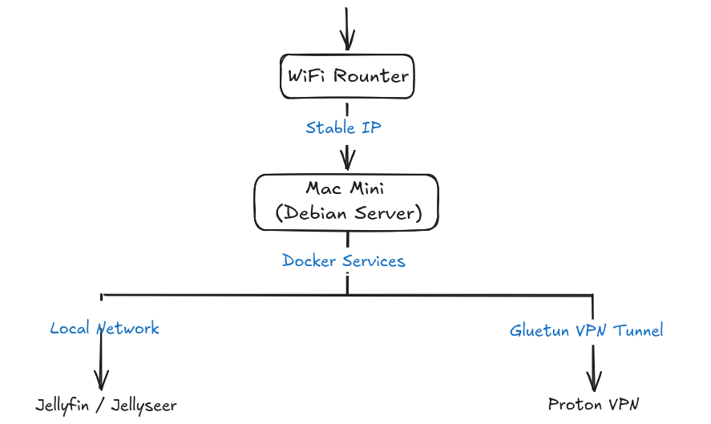

# Network

## Overview

The server uses Wi-Fi as its primary network connection and is accessible remotely over SSH from devices on the local network.

## Network Configuration

* Connection: Wi-Fi
* Interface: `enp1s0f0`
* IP assignment: Stable Lan IP
* Gateway: Home router
* DNS: Home router
* Wired interface: `enp1s0f0`
* Wired status: Unused 

> Actual IP addresses, MAC addresses, Wi-Fi credentials, and other network-specific information are intentionally not stored in this public repository.

## Network Architecture



## Stable LAN IP

The server is configured with a stable LAN IP so that its address does not change unexpectedly after a reboot or DHCP lease renewal.

The actual address is intentionally omitted from this public repository.

The stable IP is primarily used for:

* SSH access
* Local network services
* Service-to-service communication
* Reliable access from other devices on the LAN

## Wi-Fi

The primary network interface is:

```text
wlp2s0b1
```

The Mac mini's Broadcom Wi-Fi hardware requires the `b43` firmware.

The firmware issue encountered during installation and its resolution are documented in [`installation.md`](./installation.md).

Check the interface:

```bash
ip link show wlp2s0b1
```

Check the Wi-Fi device through NetworkManager:

```bash
nmcli device status
```

## Network Management

Network configuration is managed using NetworkManager.

Check NetworkManager:

```bash
systemctl status NetworkManager
```

List network devices:

```bash
nmcli device status
```

List configured connections:

```bash
nmcli connection show
```

Show active connections:

```bash
nmcli connection show --active
```

Show detailed device information:

```bash
nmcli device show wlp2s0b1
```

## DNS

DNS is provided by the home router.

View the current DNS configuration:

```bash
resolvectl status
```

Check DNS resolution:

```bash
resolvectl query google.com
```

## Routing

The server uses the home router as its default gateway.

View the current routing table:

```bash
ip route
```

The default route can be identified with:

```bash
ip route | grep default
```

## Verification

### Network Interface

```bash
ip link
```

### IP Address

```bash
ip addr
```

Verify the configured stable LAN address:

```bash
ip addr show wlp2s0b1
```

> The actual IP address should be verified on the server rather than stored in this public repository.

### Gateway

```bash
ip route
```

### DNS

```bash
resolvectl status
```

### Local Network Connectivity

Test connectivity to the local gateway:

```bash
ping -c 4 <gateway-ip>
```

### Internet Connectivity

Test IP connectivity without relying on DNS:

```bash
ping -c 4 8.8.8.8
```

Test DNS resolution and Internet connectivity:

```bash
ping -c 4 google.com
```

### SSH

From another device on the same LAN:

```bash
ssh <username>@<server-ip>
```

## Current Status

* [x] Wi-Fi configured
* [x] Stable LAN IP configured
* [x] Default gateway configured
* [x] DNS configured
* [x] Internet connectivity verified
* [x] SSH accessible over LAN
* [ ] Firewall configured
* [ ] Remote access from outside the LAN
* [ ] Network monitoring
