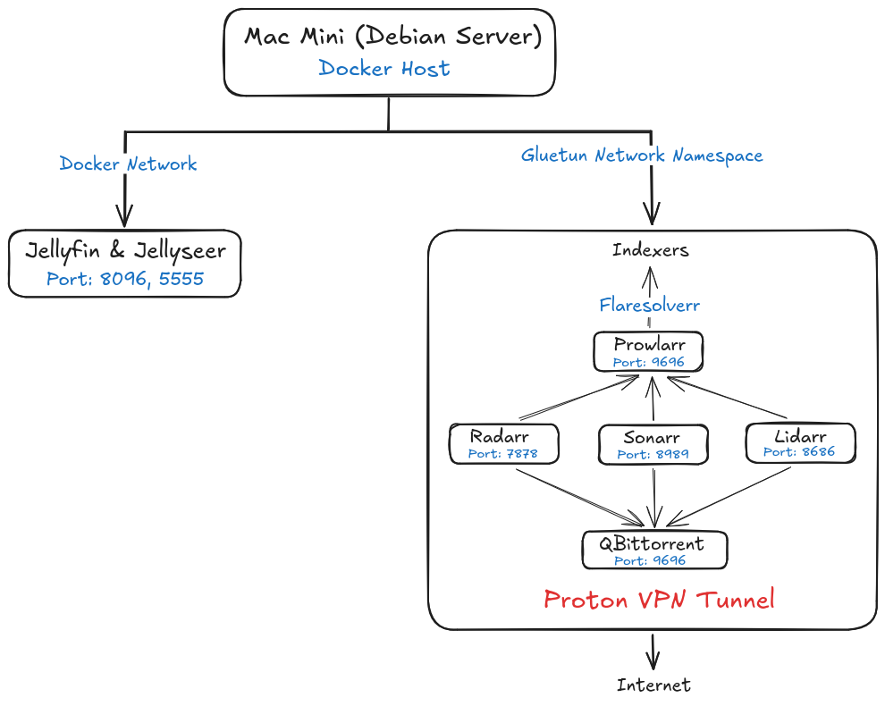

# Docker

Docker is used to run the services on the home server. Docker Compose is used to define and manage multi-container applications.

## Architecture 



## Installation

Docker is installed directly on the Debian host.

1) Install Prerequisites : 

```bash
   sudo apt update
   sudo apt install ca-certificates curl
   sudo install -m 0755 -d /etc/apt/keyrings
   sudo curl -fsSL https://download.docker.com/linux/debian/gpg -o /etc/apt/keyrings/docker.asc
   sudo chmod a+r /etc/apt/keyrings/docker.asc
```

2) Add the Repository :

```bash
 sudo tee /etc/apt/sources.list.d/docker.sources <<EOF
   Types: deb
   URIs: https://download.docker.com/linux/debian
   Suites: $(. /etc/os-release && echo "$VERSION_CODENAME")
   Components: stable
   Signed-By: /etc/apt/keyrings/docker.asc
   EOF
```
3) Install Docker Engine and Compose :

```bash
   sudo apt update
   sudo apt install docker-ce docker-ce-cli containerd.io docker-buildx-plugin docker-compose-plugin
```

The Docker daemon runs on the host and containers are managed using Docker Compose.

## Docker Directory

Docker-related deployments are stored under:

```text
~/docker/
└── jellyfin/
    └── compose.yml
```

The `jellyfin` directory contains the complete media-server deployment, including the Compose configuration, application configuration, cache, and media data.

## Media Server Deployment

The media server is defined in:

```text
~/docker/jellyfin/compose.yml
```

The deployment contains the following services:

| Service      | Purpose                       |
| ------------ | ----------------------------- |
| Jellyfin     | Media streaming               |
| Jellyseerr   | Media request management      |
| Gluetun      | VPN gateway                   |
| qBittorrent  | Download client               |
| Radarr       | Movie management              |
| Sonarr       | TV show management            |
| Lidarr       | Music management              |
| Prowlarr     | Indexer management            |
| FlareSolverr | Cloudflare challenge handling |

## Docker Compose

The media server is managed as a single Docker Compose project.

### Start the services

```bash
cd ~/docker/jellyfin
docker compose up -d
```

### Stop the services

```bash
cd ~/docker/jellyfin
docker compose down
```

### Check service status

```bash
docker compose ps
```

### View logs

```bash
docker compose logs -f
```

To view the logs for an individual service:

```bash
docker compose logs -f jellyfin
docker compose logs -f gluetun
docker compose logs -f qbittorrent
docker compose logs -f radarr
docker compose logs -f sonarr
docker compose logs -f lidarr
docker compose logs -f prowlarr
docker compose logs -f jellyseerr
```

## Updating Containers

Images can be updated with:

```bash
cd ~/docker/jellyfin
docker compose pull
docker compose up -d
```

`docker compose pull` downloads newer versions of the configured images, while `docker compose up -d` recreates containers when required.

## Container Networking

Most of the media automation services use Gluetun as their network namespace.

The following services use:

```yaml
network_mode: "service:gluetun"
```

* qBittorrent
* Radarr
* Sonarr
* Lidarr
* Prowlarr
* FlareSolverr

Docker's `service:<name>` network mode makes a container use the network namespace of the specified service.

Therefore, these services share Gluetun's network connection and their external network traffic is routed through the VPN.

Jellyfin and Jellyseerr are not placed behind Gluetun because they need to be directly accessible to clients on the local network.

## Persistent Data

The containers use bind mounts rather than storing important application data only inside the container.

The deployment directory contains:

```text
~/docker/jellyfin/
├── compose.yml
├── gluetun/
├── jellyfin-cache/
├── jellyfin-config/
├── jellyseerr/
├── lidarr/
├── prowlarr/
├── qbittorrent/
├── radarr/
├── sonarr/
└── data/
```

Removing and recreating a container therefore does not remove its persistent configuration.

## Container User

Services that use the LinuxServer images run with:

```yaml
PUID=1000
PGID=1000
```

This maps container file operations to the server's primary user/group and helps maintain consistent permissions on the mounted media directories.

Jellyfin similarly runs using:

```yaml
user: 1000:1000
```

## Environment Variables

Configuration that should not be hard-coded into Compose is provided through environment variables.

Examples include:

```text
TIMEZONE
DATA_LOCATION
OPENVPN_USER
OPENVPN_PASSWORD
```

The `.env.example` file contains the varialbel names and example values to be used in the actual `.env` file.
The `.env` file must remain only on the server and not be commited to the repo.

## Hardware Acceleration

Jellyfin can use the host's GPU/video device for hardware-accelerated transcoding when correctly configured.

The `/dev/dri` device is passed to the Jellyfin container for this purpose.

Jellyfin's documentation recommends passing the relevant `/dev/dri` device to the container and configuring the appropriate `render`/`video` permissions for Linux hardware acceleration.

The hardware acceleration configuration should be verified separately after changes to the host kernel, GPU drivers, or Jellyfin container.
