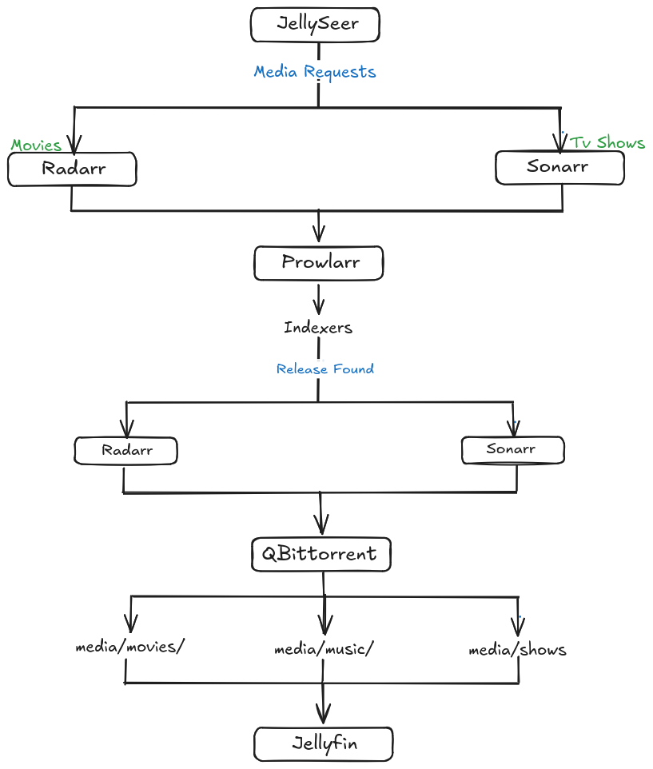

# Media Server

## Overview

The media server is a single Docker Compose project that provides a self-hosted media streaming and automation stack. Users request media, the automation services find and download it through a VPN, and Jellyfin serves the organized library to clients.

The deployment lives in:

```text
~/docker/jellyfin/compose.yml
```

For general Docker usage (starting, stopping, updating, logs) see [docker.md](./docker.md). For directory layout and disk usage see [storage.md](./storage.md).

## Workflow



1. A user requests a movie or TV show in **Jellyseerr**.
2. Jellyseerr forwards movie requests to **Radarr** and TV requests to **Sonarr**.
3. Radarr and Sonarr ask **Prowlarr** to search its configured indexers.
4. When a release is found, Radarr/Sonarr send it to **qBittorrent**.
5. qBittorrent downloads the files to `/data/downloads`.
6. Radarr/Sonarr import the finished download into `/data/media/movies` or `/data/media/shows`.
7. **Jellyfin** picks up the new media and makes it available to clients.

Music follows the same path using **Lidarr** and `/data/media/music`. Lidarr is not shown in the diagram.

## Services at a Glance

| Service      | Purpose                       | Port (host) | Network         |
| ------------ | ----------------------------- | ----------- | --------------- |
| Jellyfin     | Media streaming               | 8096        | Direct          |
| Jellyseerr   | Media request management      | 5055        | Direct          |
| Gluetun      | VPN gateway                   | -           | Direct          |
| qBittorrent  | Download client               | 8701        | Behind Gluetun  |
| Radarr       | Movie management              | 7878        | Behind Gluetun  |
| Sonarr       | TV show management            | 8989        | Behind Gluetun  |
| Lidarr       | Music management              | 8686        | Behind Gluetun  |
| Prowlarr     | Indexer management            | 9696        | Behind Gluetun  |
| FlareSolverr | Cloudflare challenge handling | 8191        | Behind Gluetun  |

Ports for services behind Gluetun are published on the `gluetun` container, because those services share its network namespace.

---

## Jellyfin

**Purpose:** Media server that streams the movie, TV, and music libraries to clients.

| Item      | Value                                    |
| --------- | ---------------------------------------- |
| Image     | `jellyfin/jellyfin`                      |
| Container | `jellyfin`                               |
| Web UI    | `http://<server-ip>:8096`                |
| User      | `1000:1000`                              |
| Restart   | `unless-stopped`                         |

**Volumes**

| Host                 | Container | Contents                |
| -------------------- | --------- | ----------------------- |
| `./jellyfin-config`  | `/config` | Configuration/database  |
| `./jellyfin-cache`   | `/cache`  | Cache                   |
| `${DATA_LOCATION}`   | `/data`   | Media library           |

**Notes**

- Not placed behind Gluetun so that clients on the local network can reach it directly.
- Libraries should point at `/data/media/movies`, `/data/media/shows`, and `/data/media/music`.
- The `7359/udp` port (client auto-discovery) is commented out in the Compose file.

---

## Jellyseerr

**Purpose:** Request management front end. Users browse and request movies and shows, and Jellyseerr passes the requests to Radarr and Sonarr.

| Item      | Value                        |
| --------- | ---------------------------- |
| Image     | `fallenbagel/jellyseerr:latest` |
| Container | `jellyseerr`                 |
| Web UI    | `http://<server-ip>:5055`    |
| Restart   | `unless-stopped`             |

**Volumes**

| Host            | Container     | Contents      |
| --------------- | ------------- | ------------- |
| `./jellyseerr`  | `/app/config` | Configuration |

**Notes**

- Not behind Gluetun, so it stays directly reachable on the local network.
- Because it is outside Gluetun's network, Radarr and Sonarr must be reached through the ports published on the host (for example `<server-ip>:7878` and `<server-ip>:8989`), not through container names.
- `depends_on` lists Gluetun, Jellyfin, Sonarr, and Radarr so they start first.
- Setup: sign in with Jellyfin, then add Radarr and Sonarr under **Settings → Services**.

---

## Gluetun

**Purpose:** VPN client and gateway. Services that use `network_mode: "service:gluetun"` send all of their external traffic through this container's VPN tunnel.

| Item      | Value                  |
| --------- | ---------------------- |
| Image     | `qmcgaw/gluetun`       |
| Container | `gluetun`              |
| Provider  | ProtonVPN (OpenVPN)    |
| Servers   | Country: India         |

**Configuration**

| Setting                | Value / Source              |
| ---------------------- | --------------------------- |
| `VPN_SERVICE_PROVIDER` | `protonvpn`                 |
| `VPN_TYPE`             | `openvpn`                   |
| `OPENVPN_USER`         | `${OPENVPN_USER}` (`.env`)  |
| `OPENVPN_PASSWORD`     | `${OPENVPN_PASSWORD}` (`.env`) |
| `VPN_PORT_FORWARDING`  | `on`                        |
| `SERVER_COUNTRIES`     | `India`                     |
| `TZ`                   | `${TIMEZONE}` (`.env`)      |

**Requirements**

- `cap_add: NET_ADMIN`
- `/dev/net/tun` passed through as a device

**Published ports (for the services behind it)**

| Port        | Service              |
| ----------- | -------------------- |
| 8701        | qBittorrent Web UI   |
| 6881 (TCP/UDP) | Torrent traffic   |
| 7878        | Radarr               |
| 8989        | Sonarr               |
| 8686        | Lidarr               |
| 9696        | Prowlarr             |
| 8191        | FlareSolverr         |

**Volumes**

| Host        | Container  |
| ----------- | ---------- |
| `./gluetun` | `/gluetun` |

**Notes**

- If Gluetun stops or its tunnel drops, the services behind it lose connectivity rather than leaking traffic over the normal connection.
- If Gluetun is recreated (for example after an image update), restart the services that depend on it so they reattach to its network namespace.
- Check VPN status with `docker compose logs -f gluetun`.

---

## qBittorrent

**Purpose:** Download client. Receives downloads from Radarr, Sonarr, and Lidarr.

| Item      | Value                                  |
| --------- | -------------------------------------- |
| Image     | `lscr.io/linuxserver/qbittorrent:latest` |
| Container | `qbittorrent`                          |
| Web UI    | `http://<server-ip>:8701`              |
| Network   | `service:gluetun`                      |
| Restart   | `unless-stopped`                       |

**Environment**

| Variable          | Value           |
| ----------------- | --------------- |
| `PUID` / `PGID`   | `1000` / `1000` |
| `TZ`              | `${TIMEZONE}`   |
| `WEBUI_PORT`      | `8701`          |
| `TORRENTING_PORT` | `6881`          |

**Volumes**

| Host               | Container | Contents       |
| ------------------ | --------- | -------------- |
| `./qbittorrent`    | `/config` | Configuration  |
| `${DATA_LOCATION}` | `/data`   | Downloads/media |

**Notes**

- Download location: `/data/downloads`.
- Files stay here until Radarr, Sonarr, or Lidarr import them.
- `stop_grace_period` is set to `10s`.

---

## Radarr

**Purpose:** Movie management. Searches for requested movies, sends releases to qBittorrent, then imports and renames finished downloads.

| Item      | Value                              |
| --------- | ---------------------------------- |
| Image     | `lscr.io/linuxserver/radarr`       |
| Container | `radarr`                           |
| Web UI    | `http://<server-ip>:7878`          |
| Network   | `service:gluetun`                  |

**Volumes**

| Host               | Container |
| ------------------ | --------- |
| `./radarr`         | `/config` |
| `${DATA_LOCATION}` | `/data`   |

**Notes**

- Root folder: `/data/media/movies`.
- Download client: qBittorrent at `localhost:8701` (same network namespace as Gluetun).
- Indexers are supplied by Prowlarr.

---

## Sonarr

**Purpose:** TV show management. Same role as Radarr, for series and episodes.

| Item      | Value                              |
| --------- | ---------------------------------- |
| Image     | `lscr.io/linuxserver/sonarr`       |
| Container | `sonarr`                           |
| Web UI    | `http://<server-ip>:8989`          |
| Network   | `service:gluetun`                  |

**Volumes**

| Host               | Container |
| ------------------ | --------- |
| `./sonarr`         | `/config` |
| `${DATA_LOCATION}` | `/data`   |

**Notes**

- Root folder: `/data/media/shows`.
- Download client: qBittorrent at `localhost:8701`.
- Indexers are supplied by Prowlarr.

---

## Lidarr

**Purpose:** Music management. Same role as Radarr and Sonarr, for artists and albums.

| Item      | Value                                  |
| --------- | -------------------------------------- |
| Image     | `lscr.io/linuxserver/lidarr:latest`    |
| Container | `lidarr`                               |
| Web UI    | `http://<server-ip>:8686`              |
| Network   | `service:gluetun`                      |

**Volumes**

| Host               | Container |
| ------------------ | --------- |
| `./lidarr`         | `/config` |
| `${DATA_LOCATION}` | `/data`   |

**Notes**

- Root folder: `/data/media/music`.
- Download client: qBittorrent at `localhost:8701`.
- Lidarr is not connected to Jellyseerr, so music is added directly in Lidarr rather than requested.

---

## Prowlarr

**Purpose:** Central indexer manager. Indexers are configured once in Prowlarr and synced to Radarr, Sonarr, and Lidarr.

| Item      | Value                              |
| --------- | ---------------------------------- |
| Image     | `lscr.io/linuxserver/prowlarr`     |
| Container | `prowlarr`                         |
| Web UI    | `http://<server-ip>:9696`          |
| Network   | `service:gluetun`                  |

**Volumes**

| Host         | Container |
| ------------ | --------- |
| `./prowlarr` | `/config` |

**Notes**

- Does not mount `/data`, since it never touches media files.
- Connect each Arr app under **Settings → Apps** using its Gluetun-shared address (`http://localhost:<port>`).
- For indexers protected by Cloudflare, add FlareSolverr under **Settings → Indexers** (`http://localhost:8191`).

---

## FlareSolverr

**Purpose:** Proxy that solves Cloudflare challenges so Prowlarr can query indexers that would otherwise block it.

| Item      | Value                                    |
| --------- | ---------------------------------------- |
| Image     | `ghcr.io/flaresolverr/flaresolverr:latest` |
| Container | `flaresolverr`                           |
| Endpoint  | `http://<server-ip>:8191`                |
| Network   | `service:gluetun`                        |

**Notes**

- No volumes; it is stateless.
- Used only by Prowlarr, via a tag-based proxy entry.

---

## Environment Variables

Set in the `.env` file next to `compose.yml`. Copy from `.env.example` and keep `.env` out of the repository.

| Variable           | Used by         | Description                                    |
| ------------------ | --------------- | ---------------------------------------------- |
| `TIMEZONE`         | All services    | Container time zone (e.g. `Asia/Kolkata`)      |
| `DATA_LOCATION`    | Jellyfin, qBittorrent, Radarr, Sonarr, Lidarr | Host path mounted at `/data` |
| `OPENVPN_USER`     | Gluetun         | ProtonVPN OpenVPN username                     |
| `OPENVPN_PASSWORD` | Gluetun         | ProtonVPN OpenVPN password                     |

## Startup Order

`depends_on` is used so that Gluetun starts before everything routed through it:

```text
gluetun ──► qbittorrent, radarr, sonarr, lidarr, prowlarr, flaresolverr
jellyfin, sonarr, radarr, gluetun ──► jellyseerr
```

`depends_on` only controls start order, not readiness, so a service may briefly start before the VPN tunnel is fully up.

## Known Issues and Suggestions
- **Diagram.** The diagram shows qBittorrent writing directly into the media folders. In practice qBittorrent downloads to `/data/downloads` and Radarr/Sonarr/Lidarr import the files into the media folders.
